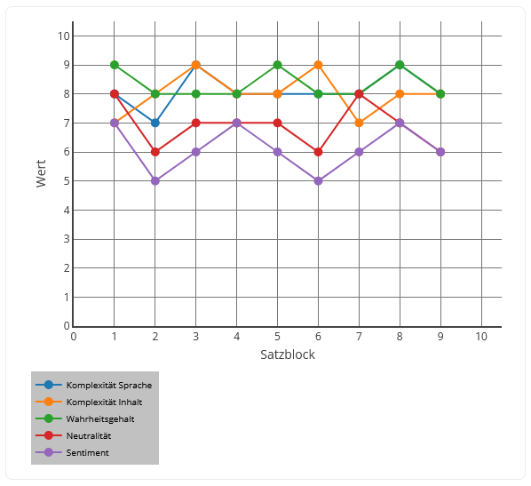

# Text Check

(German version below!)

Welcome to Text Check! With this web app, you can analyze and compare two texts with the help of ChatGPT. For example, you can check whether the facts presented in a text are true (or more precisely: whether ChatGPT assesses them as true). The web app a typical [**Shiny app**](https://shiny.posit.co/r/getstarted/shiny-basics/lesson1/index.html) which is written in one single script. Therefore, for a better understanding, it is recommended to read the script also from the bottom to the top. A great advantage of Shiny is its [reactivity](https://mastering-shiny.org/basic-reactivity.html).

The data flow through the app is as follows: When the user has inserted a text to analyze and pushes the button in the user interface, an event is triggered (in the function with the name "funk_server_erstellen"). Take another look [here](https://shiny.posit.co/r/getstarted/shiny-basics/lesson1/index.html) for more information what "server" means in the context of a Shiny app. The main work in the script is now covered by the function with the name "funk_arbeiten_buttonpress". This function utilizes multiple helper functions in a pipeline-like fashion to compute the final results, i. e. the objects which could be presented to the user in the user interface. The pipeline in a nutshell: The text is divided into blocks of 5 sentences each. These blocks are analyzed by ChatGPT with regard to various criteria. Finally the answer from ChatGPT is presented to the user as numerical values in a line chart (one block of 5 sentences = one "Satzblock" in german; "Komplexität Sprache" = complexity of language; "Komplexität Inhalt" = complexity of information content; "Wahrheitsgehalt" = truthfulness; "Neutralität" = neutrality; "Sentiment" = sentiment):

The actual analyzing by ChatGPT is done by sending it a message containing a prompt and the text to analyze. The communication with ChatGPT takes place via [structured outputs](https://platform.openai.com/docs/guides/structured-outputs).

The user interface is basically created with navigation panels and [bslib Card objects](https://rstudio.github.io/bslib/articles/cards/) which are additionally modified by some HTML (look for the object named "ui_objekt" in the code).

## Prerequisites and requirements

The R script was written in a local envrionment with R 4.4.1 installed. But the web app was developed with the intention to deploy it to [Heroku](https://devcenter.heroku.com/articles/git#create-a-heroku-remote). The third party [Heroku buildpack for R](https://elements.heroku.com/buildpacks/virtualstaticvoid/heroku-buildpack-r) unfortunately just supports R versions up to 4.2.1. Because the [renv snapshot](https://cran.r-project.org/web/packages/renv/vignettes/renv.html) of the development environment was based around R 4.4.1, the author of this web app therefore adjusted the renv.lock file manually: The R version in the file was changed from 4.4.1 to 4.2.1 and the sections for the packages "MASS" and "Matrix" were deleted (these two packages require R 4.4.0 or higher). To sum it up: The web app was tested locally with R 4.4.1 and on Heroku with R 4.2.1. So probably it should also run locally with R 4.2.1 (but this was not tested).

To actually use the web app, you need an [API project key](https://help.openai.com/en/articles/9186755-managing-your-work-in-the-api-platform-with-projects) for ChatGPT. Also, you have to choose an AI model from all the [available ones](https://platform.openai.com/docs/models). This means in the R script, you have to give a value to the variables "GLOBAL_API_SCHLUESSEL" (at the top of the script) and "model" (in the function "funk_dataframe_von_gpt_anfordern"). But caution: Do not insert your API key hard coded into the R script when deploying to Heroku, use [Config Vars](https://devcenter.heroku.com/articles/config-vars) instead.

## Disclaimer

Notice that there is [**no license**](https://docs.github.com/en/repositories/managing-your-repositorys-settings-and-features/customizing-your-repository/licensing-a-repository) for this project, so (re)use of the code is prohibited.

--------------------------------------------------------------------------------------------------------------
# Deutsche Version

Willkommen bei Text Check! Mit dieser Web App kannst du zwei Texte mit der Hilfe von ChatGPT analysieren und vergleichen. Beispielsweise kannst du prüfen, ob die präsentierten Fakten in einem Text wahr sind (oder präziser: ob ChatGPT diese als wahr beurteilt). Die Web App ist eine typische [**Shiny App**](https://shiny.posit.co/r/getstarted/shiny-basics/lesson1/index.html), welche in einem einzeigen Skript verfasst ist. Es wird deshalb empfohlen, das Skript auch von unten nach oben zu lesen, um es besser zu verstehen. Ein großer Vorteil von Shiny ist dessen [Reactivity](https://mastering-shiny.org/basic-reactivity.html).

Der Datenfluss durch die App ist folgendermaßen: Wenn der/die User/-in einen Text zur Analyse eingegeben hat und den Button im User Interface drückt, wird ein Event ausgelöst (in der Funktion mit dem Namen "funk_server_erstellen"). Schaue noch einmal [hier](https://shiny.posit.co/r/getstarted/shiny-basics/lesson1/index.html) für mehr Informationen dazu, was "Server" im Kontext einer Shiny Web App bedeutet. Die Hauptarbeit im Skript wird nun von der Funktion mit dem Namen "funk_arbeiten_buttonpress" übernommen. Diese Funktion nutzt mehrere Hilfs-Funktionen in einer pipelineartigen Weise, um die finalen Ergebnisse zu berechnen, d. h. die Objekte, welche dem/der User/-in im User Interface präsentiert werden können. Die Pipeline in Kurzform erläutert: Der Text wird in Satzblöcke mit jeweils 5 Sätzen unterteilt. Diese Blöcke werden von ChatGPT hinsichtlich unterschiedlicher Kriterien analysiert. Zum Schluss wird die Antwort von ChatGPT dem/der User/-in als numerische Werte in einem Liniendiagramm präsentiert:

Die eigentliche Analyse durch ChatGPT erfolgt, indem es eine Nachricht erhält, welche einen Prompt und den zu analysierenden Text enthält. Die Kommunikation mit ChatGPT erfolgt mittels [Structured Outputs](https://platform.openai.com/docs/guides/structured-outputs).

Das User Interface ist im Allgemeinen mit Navigation Panels und [bslib Card Objekten](https://rstudio.github.io/bslib/articles/cards/) erstellt, welche zusätzlich noch mit etwas HTML modifiziert sind (suche nach dem Objekt mit dem Namen "ui_object" im Code).

## Voraussetzungen und Anforderungen

Das R Skript wurde in einer lokalen Umgebung geschrieben, in der R 4.4.1 installiert war. Die Web App wurde jedoch mit der Intention entwickelt, sie auf [Heroku](https://devcenter.heroku.com/articles/git#create-a-heroku-remote) zu veröffentlichen. Das third party [Heroku Buildpack für R](https://elements.heroku.com/buildpacks/virtualstaticvoid/heroku-buildpack-r) unterstützt leider nur R Versionen bis 4.2.1. Weil der [renv Snapshot](https://cran.r-project.org/web/packages/renv/vignettes/renv.html) der Entwicklungsumgebung auf R 4.4.1 basiert, hat der Autor dieser Web App die renv.lock Datei manuell angepasst: Die R Version in dieser Datei wurde von 4.4.1 auf 4.2.1 geändert und die Abschnitte zu den Packages "MASS" und "Matrix" gelöscht (diese zwei Packages benötigen R 4.4.0 oder höher). Zusammengefasst: Die Web App wurde lokal mit R 4.4.1 und auf Heroku mit R 4.2.1 getestet. Wahrscheinlich sollte die App also auch lokal mit R 4.2.1 laufen (dies wurde aber nicht geprüft).

Um die Web App tatsächlich zu nutzen, brauchst du einen [API Project Key](https://help.openai.com/en/articles/9186755-managing-your-work-in-the-api-platform-with-projects) für ChatGPT. Zudem musst du ein AI Modell aus allen [verfügbaren](https://platform.openai.com/docs/models) wählen. Das bedeutet, dass du im R Skript den Variablen "GLOBAL_API_SCHLUESSEL" (oben im Skript) und "model" (in der Funktion "funk_dataframe_von_gpt_anfordern") einen Wert zuweisen musst. Aber Vorsicht: Füge deinen API Key nicht hard coded in das R Skript ein, wenn du ein Deployment bei Heroku vornimmst, sondern nutze stattdessen [Config Vars](https://devcenter.heroku.com/articles/config-vars).

## Disclaimer

Es sei darauf hingewiesen, dass [**keine Lizenz**](https://docs.github.com/en/repositories/managing-your-repositorys-settings-and-features/customizing-your-repository/licensing-a-repository) für dieses Projekt vorliegt, sodass eine (Weiter-)verwendung dieses Codes nicht erlaubt ist.